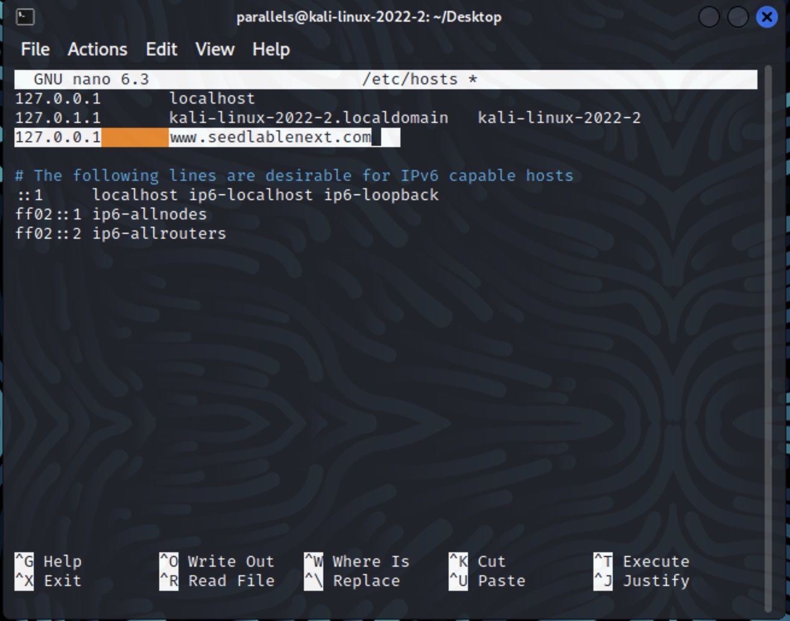
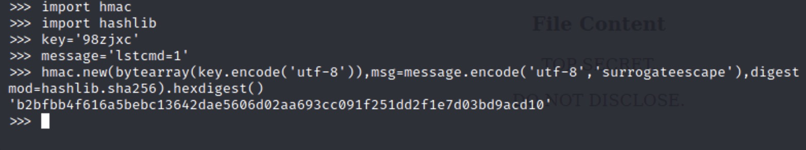

# Applied Cryptography

<table style="width:100%">
  <tr>
    <th align="left">Name</th>
    <td>Naman Choudhary</td>
  </tr>
  <tr>
    <th align="left">SRN</th>
    <td>PES2UG20CS209</td>
  </tr>
  <tr>
    <th align="left">Section</th>
    <td>D</td>
  </tr>
</table>

## Hash Length Extension Attack Lab

## Lab Setup

Setting up the hostname


The server program


## Task 1:Send Request to List Files

Calculating the MAC address


Result on the website


When an invalid MAC is given


Contents of secret.txt


Contents of key.txt


## Task 2:Create Padding


## Task 3:Compute MAC using Secret Key

```c
/* calculate_mac.c */
#include <stdio.h>
#include <openssl/sha.h>
int main(int argc, const char *argv[])
{
   SHA256_CTX c;
   unsigned char buffer[SHA256_DIGEST_LENGTH];
   int i;
   SHA256_Init(&c);
SHA256_Update(&c,
   "This is a test message"
   "\x80"
   "\x00\x00\x00\x00\x00\x00\x00\x00\x00\x00"
   "\x00\x00\x00\x00\x00\x00\x00\x00\x00\x00"
   "\x00\x00\x00\x00\x00\x00\x00\x00\x00\x00"
"\x00\x00\x00"
   "\x00\x00\x00\x00\x00\x00\x00\xB0"
   "Extra message",
   64+13);
SHA256_Final(buffer, &c);
for(i = 0; i < 32; i++) {
     printf("%02x", buffer[i]);
   }
   printf("\n");
   return 0;
}
```

Using Python to create padding


Website ouput


## Task 4:Length Extension Attack


Website output


## Task 5:Attack Mitigation using HMAC

Using Python to calculate HMAC


