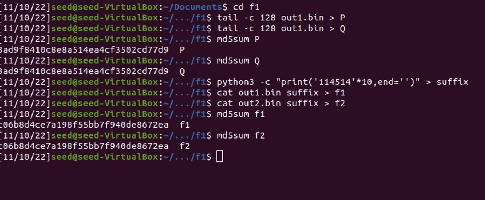

# Applied Cryptography

<table style="width:100%">
  <tr>
    <th align="left">Name</th>
    <td>Naman Choudhary</td>
  </tr>
  <tr>
    <th align="left">SRN</th>
    <td>PES2UG20CS209</td>
  </tr>
  <tr>
    <th align="left">Section</th>
    <td>D</td>
  </tr>
</table>

## MD5

### Task 1

Observation: if the length of prefix is not multiple of 64, it will be padded with zeros

### Task 2

### Task 3

### Task 4

