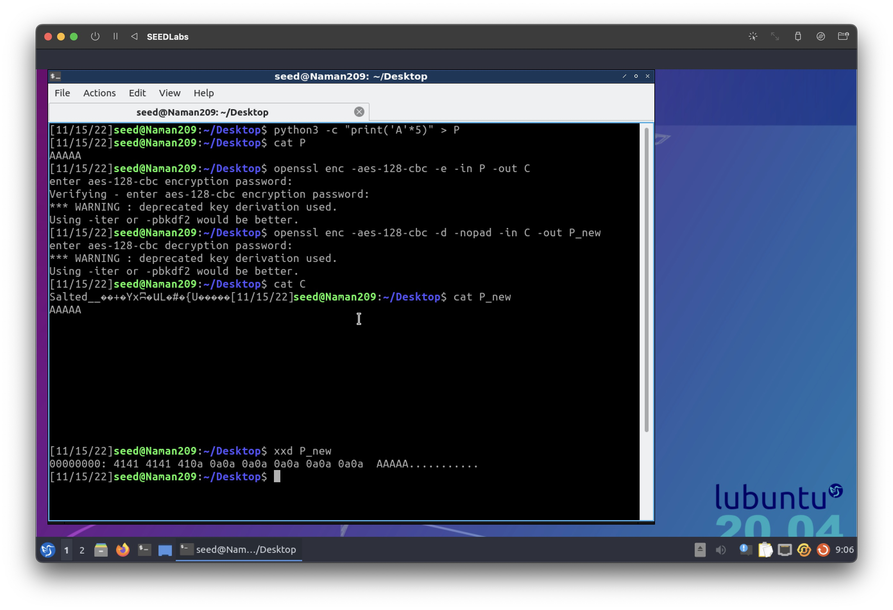

# Applied Cryptography

<table style="width:100%">
  <tr>
    <th align="left">Name</th>
    <td>Naman Choudhary</td>
  </tr>
  <tr>
    <th align="left">SRN</th>
    <td>PES2UG20CS209</td>
  </tr>
  <tr>
    <th align="left">Section</th>
    <td>D</td>
  </tr>
</table>

## Oracle Padding Attack

## Task 1:Getting Familiar with Padding

```bash
$ python3 -c "print('A'*5)" >P
$ openssl enc -aes-128-cbc -e -in P -out C
$ openssl enc -aes-128-cbc -d -nopad -in C -out P_new
$ xxd P_new
```



```bash
$ python3 -c "print('A'*10)" >P
$ openssl enc -aes-128-cbc -e -in P -out C
$ openssl enc -aes-128-cbc -d -nopad -in C -out P_new
$ xxd P_new
```


```bash
$ python3 -c "print('A'*27)" >P
$ openssl enc -aes-128-cbc -e -in P -out C
$ openssl enc -aes-128-cbc -d -nopad -in C -out P_new
$ xxd P_new
```


**Question:** What do you deduce about the encryption scheme?

**Answer:** The encryption scheme uses CBC mode and its security is proportional to input length


## Task 2:Padding Oracle Attack (Level 1)

```bash
$ nc 10.9.0.80 5000 #level1
$ nc 10.9.0.80 6000 #level2
```


```bash
$ ./manual_attack
```


## Task 3:Padding Oracle Attack (Level 2)

```bash
$ ./automated_attack
```

