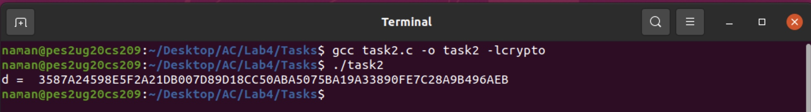
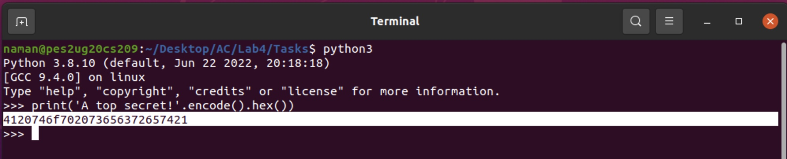
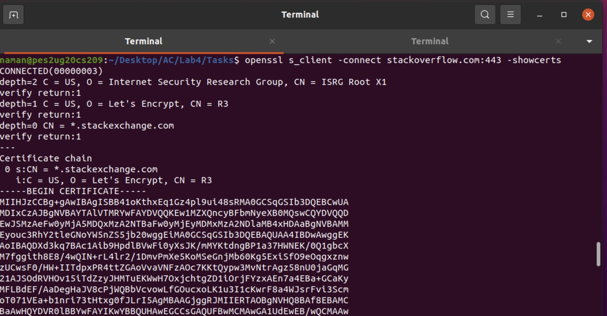

# Applied Cryptography

<table style="width:100%">
  <tr>
    <th align="left">Name</th>
    <td>Naman Choudhary</td>
  </tr>
  <tr>
    <th align="left">SRN</th>
    <td>PES2UG20CS209</td>
  </tr>
  <tr>
    <th align="left">Section</th>
    <td>D</td>
  </tr>
</table>

## Lab 4
### RSA Public-Key Encryption and Signature Lab
##Task 1: A Complete Example of BIGNUM

### Code

```c
#include <stdio.h>
#include <openssl/bn.h>
#define NBITS 256

void printBN(char *msg, BIGNUM *a)
{
    /*Use BN_bn2hex(a) for hex string
    Use BN_bn2dec(a) for decimal string*/

    char*number_str = BN_bn2hex(a);
    printf("%s %s\n", msg, number_str);
    OPENSSL_free(number_str);
}

int main ()
{
    BN_CTX*ctx = BN_CTX_new();
    BIGNUM*a = BN_new();
    BIGNUM*b = BN_new();
    BIGNUM*n = BN_new();
    BIGNUM*res = BN_new();

    // Initialize a, b, n
    BN_generate_prime_ex(a, NBITS, 1, NULL, NULL, NULL);
    BN_dec2bn(&b, "273489463796838501848592769467194369268");
    BN_rand(n, NBITS, 0, 0);

    // res = a*b
    BN_mul(res, a, b, ctx);
    printBN("a*b = ", res);

    // res = aˆb mod n
    BN_mod_exp(res, a, b, n, ctx);
    printBN("aˆc mod n = ", res);
    return 0;
}
```

### Screenshots

#### Observation: Required Big Number was computed
`a*b = BB4BFE8A317A407E18E912A10C733138FA28297487894DE4D95AC73E3B4AF2C295EFDE7D9BAD15C84F96250357EB80CC`
`a^c mod n = 8E78054F8987FC78FAEFBA56AD9FD240044553B6480B06D8380C8771FA5C5580`

##Task 2: Deriving the Private Key

### Code

```c
#include <stdio.h>
#include <openssl/bn.h>
#define NBITS 256

void printBN(char *msg, BIGNUM *a)
{
    /*Use BN_bn2hex(a) for hex string
    Use BN_bn2dec(a) for decimal string*/

    char*number_str = BN_bn2hex(a);
    printf("%s %s\n", msg, number_str);
    OPENSSL_free(number_str);
}

int main ()
{
    BN_CTX *ctx = BN_CTX_new();
    BIGNUM *p= BN_new();
    BIGNUM *q= BN_new();
    BIGNUM *e= BN_new();
    BIGNUM *d = BN_new();
    BIGNUM *res1= BN_new();
    BIGNUM *res2= BN_new();
    BIGNUM *res3= BN_new();
    BIGNUM *one = BN_new();

    //initialize
    BN_hex2bn(&p,"F7E75FDC469067FFDC4E847C51F452DF");
    BN_hex2bn(&q,"E85CED54AF57E53E092113E62F436F4F");
    BN_hex2bn(&e,"0D88C3");
    BN_dec2bn(&one,"1");

    BN_sub(res1,p,one);
    BN_sub(res2,q,one);
    BN_mul(res3,res1,res2,ctx);
    BN_mod_inverse(d,e,res3,ctx);
    printBN("d = ",d);
    return 0;
}
```

### Screenshots

#### Observation: Private Key was found out
`d=3587A24598E5F2A21DB007D89D18CC50ABA5075BA19A33890FE7C28A9B496AEB`

The above code multiplies first performs res3=p*q
Then, it performs mod inverse of d & e with respect to res3 (and given e)
The output, d is printed on the screen

##Task 3: Encrypting a Message

### Code

```c
#include <stdio.h>
#include <openssl/bn.h>
#define NBITS 256

void printBN(char *msg, BIGNUM *a)
{

/* Use BN_bn2hex(a) for hex string */
/* Use BN_bn2dec(a) for decimal string*/

char *number_str = BN_bn2hex(a);
printf("%s %s\n", msg, number_str);
OPENSSL_free(number_str);
}

int main()
{
    BN_CTX *ctx = BN_CTX_new();
    BIGNUM *m = BN_new();
    BIGNUM *e = BN_new();
    BIGNUM *n = BN_new();
    BIGNUM *d = BN_new();
    BIGNUM *enc = BN_new();
    BIGNUM *dec = BN_new();

    // Initialize p, q, e
    BN_hex2bn(&m,"/*Enter the hex encoded message from previous step here*/");
    BN_hex2bn(&e,"010001");
    BN_hex2bn(&n,"DCBFFE3E51F62E09CE7032E2677A78946A849DC4CDDE3A4D0CB81629242FB1A5");
    BN_hex2bn(&d, "74D806F9F3A62BAE331FFE3F0A68AFE35B3D2E4794148AACBC26AA381CD7D30D");

    // Encryption : ree mod n
    BN_mod_exp(enc, m, e, n, ctx);
    printBN("Encrypted Message = ", enc);

    //Decryption: enc^d mod n
    BN_mod_exp(dec, enc, d, n, ctx);
    printBN("Decrypted Message=",dec);
    return 0;
}
```

### Screenshots


#### Observation: Enc and Dec verified

##Task 4: Decrypting a Message

### Code

```c
#include <stdio.h>
#include <openssl/bn.h>
#define NBITS 256

void printBN(char *msg, BIGNUM *a)
{
    /* Use BN bn2hex(a) for hex string */
    /* Use BN_bn2dec(a) for decimal string*/

    char *number_str = BN_bn2hex (a) ;
    printf("%s %s\n", msg, number_str);
    OPENSSL_free(number_str);
}


int main()
{
    BN_CTX *ctx=BN_CTX_new();
    BIGNUM *m = BN_new();
    BIGNUM *e = BN_new();
    BIGNUM *n =BN_new();
    BIGNUM *d = BN_new();
    BIGNUM *enc =BN_new();
    BIGNUM *dec=BN_new();

    // Initialize p, q, e
    BN_hex2bn(&n, "DCBFFE3E51F62E09CE7032E2677A78946A849DC4CDDE3A4D0CB81629242FB1A5");
    BN_hex2bn(&d, "74D806F9F3A62BAE331FFE3F0A68AFE35B3D2E4794148AACBC26AA381CD7D30D");
    BN_hex2bn(&enc, "8C0F971DF2F3672B28811407E2DABBE1DA0FEBBBDFC7DCB67396567EA1E2493F");

    //Decryption: enc^d mod n
    BN_mod_exp(dec, enc, d, n, ctx);
    printBN("Decrypted Message = ", dec);
    return 0;
}
```

### Screenshots

#### Observation: Message Succesfully decrypted
After conversion from Hex to Ascii
`Password is dees` is the output

##Task 5: Signing a Message

### Code

```c
#include <stdio.h>
#include <openssl/bn.h>
#define NBITS 256

void printBN(char *msg, BIGNUM *a)
{
    /* Use BN_bn2hex(a) for hex string */
    /* Use BN_bn2dec(a) for decimal string*/
    char *number_str = BN_bn2hex(a);
    printf("%s %s\n", msg, number_str);
    OPENSSL_free(number_str);
}

int main()
{
    BN_CTX *ctx = BN_CTX_new();
    BIGNUM *m = BN_new();
    BIGNUM *n = BN_new();
    BIGNUM *d = BN_new();
    BIGNUM *sign = BN_new();

    // Initialize p, q, e
    BN_hex2bn(&m,"/* hex encoded message here */");
    BN_hex2bn(&n,"DCBFFE3E51F62E09CE7032E2677A78946A849DC4CDDE3A4D0CB81629242FB1A5");
    BN_hex2bn(&d,"74D806F9F3A62BAE331FFE3F0A68AFE35B3D2E4794148AACBC26AA381CD7D30D");

    // signing : m^e mod n
    BN_mod_exp(sign, m, d, n, ctx);
    printBN("encrypted Message = ", sign);
    return 0;
}
```

### Screenshots


After Modification to `$3000`


#### Observation: In spite of the string having only 1 character changed, we observe that the encrypted text is completely modified

`$2000 gives output 80A55421D72345AC199836F60D51DC9594E2BDB4AE20C804823FB71660DE7B82`

`$3000 gives output 04FC9C53ED7BBE4ED4BE2C24BOBDF7184B96290B4ED4E3959F58E94B1ECEA2EB`

##Task 6: Verifying a signature

### Code

```c
#include <stdio.h>
#include <openssl/bn.h>
#define NBITS 256
void printBN(char *msg, BIGNUM *a)
{
    /* Use BN_bn2hex(a) for hex string */
    /* Use BN_bn2dec(a) for decimal string*/
    char *number_str = BN_bn2hex(a);
    printf("%s %s\n", msg, number_str);
    OPENSSL_free(number_str);
    }

    int main() {
    BN_CTX *ctx = BN_CTX_new();
    BIGNUM *s = BN_new();
    BIGNUM *n = BN_new();
    BIGNUM *e = BN_new();
    BIGNUM *message = BN_new();

    // Initialize p, q, e
    BN_hex2bn(&s,"643D6F34902D9C7EC90CB0B2BCA36C47FA37165C0005CAB026C0542CBDB6802F");
    BN_hex2bn(&n,"AE1CD4DC432798D933779FBD46C6E1247F0CF1233595113AA51B450F18 116115");
    BN_hex2bn(&e, "010001");

    // signing : m^e mod n
    BN_mod_exp(message, s, e, n, ctx);
    printBN("encrypted Message = ", message);
    return 0;
}
```

### Screenshots

#### Observation: Signature generated

##Task 7: Manually Verifying X.509 Certificate

### Code

```c
#include <stdio.h>
#include <openssl/bn.h>
#define NBITS 256

void printBN(char *msg, BIGNUM *a)
{
    /* Use BN_bn2hex(a) for hex string */
    /* Use BN_bn2dec(a) for decimal string*/
    char *number_str = BN_bn2hex(a);
    printf("%s %s\n", msg, number_str);
    OPENSSL_free(number_str);
}

int main()
{
    BN_CTX *ctx = BN_CTX_new();
    BIGNUM *s = BN_new();
    BIGNUM *n = BN_new();
    BIGNUM *e = BN_new();
    BIGNUM *message = BN_new();

    // Initialize p, q, e
    /* Insert the values of n and e from step 2 */
    /* Insert the value of s from step 3 */
    BN_hex2bn(&s,"");
    BN_hex2bn(&n, "");
    BN_hex2bn(&e, "");
    // signing : m^e mod n
    BN_mod_exp(message, s, e, n, ctx);
    printBN("encrypted Message = ", message);
    return 0;
}
```

### Screenshots



#### Observation:Signature verified

