# Applied Cryptography

<table style="width:100%">
  <tr>
    <th align="left">Name</th>
    <td>Naman Choudhary</td>
  </tr>
  <tr>
    <th align="left">SRN</th>
    <td>PES2UG20CS209</td>
  </tr>
  <tr>
    <th align="left">Section</th>
    <td>D</td>
  </tr>
</table>

## Public-Key Infrastructure

### Task 1:Becoming a certificate authority (CA)

```bash
openssl req -x509 -newkey rsa: 4096 -sha256 -days 3650 
-keyout ca.key
-out ca.crt
-subj "/CN=www.modelCA.com/O=Model CA LTD./C=US"
-passout pass:dees
```
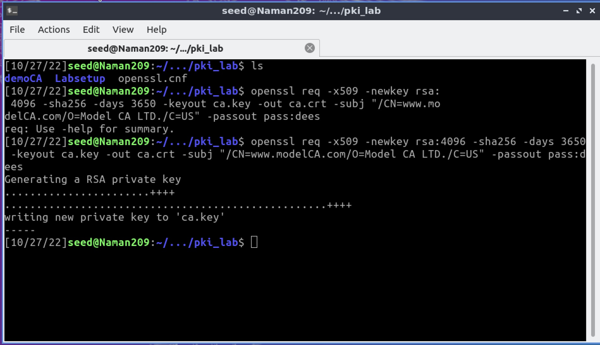


```bash
openssl x509 -in ca.crt -text -noout
```
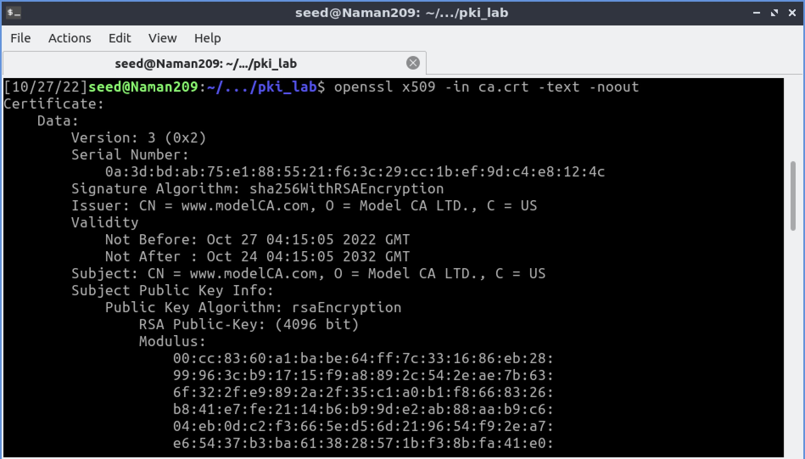


```bash
openssl rsa -in ca.key -text -noout
```
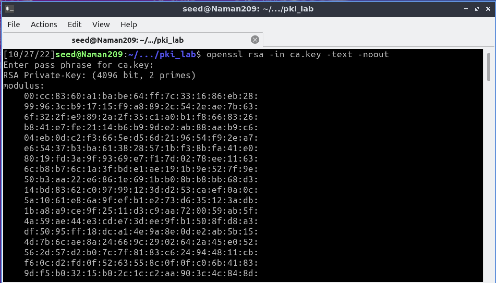

### Task 2:Generating a Certificate Request for the web server

```bash
openssl req -newkey rsa:2048 -sha256
-keyout server.key
-out server.csr
-subj "/CN=www.bank32.com/O=Bank32 Inc./C=US"
-passout pass:dees
-addext "subjectAltName = DNS:www.bank32.
DNS:www.bank32A.com, \
DNS:www.bank32B.com"
```
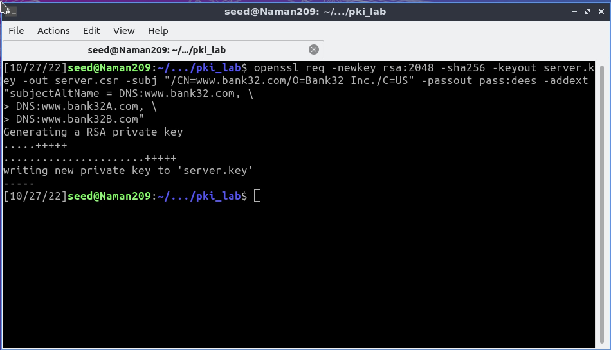


```bash
openssl req -in server.csr -text -noout
```
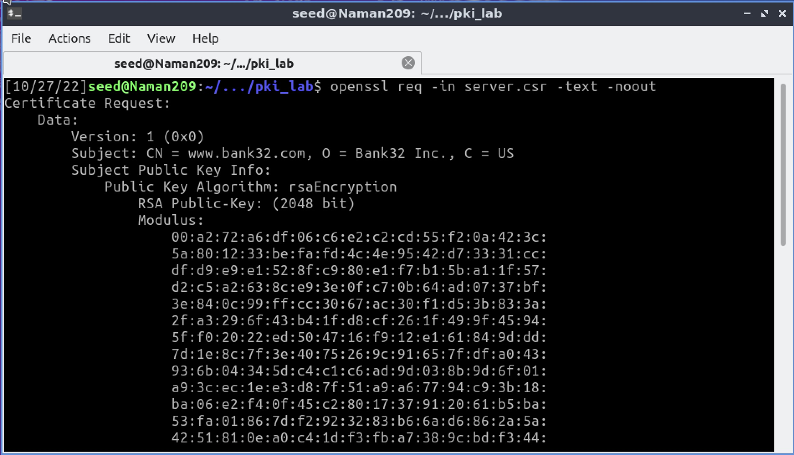


```bash
openssl rsa -in server.key -text -noout
```
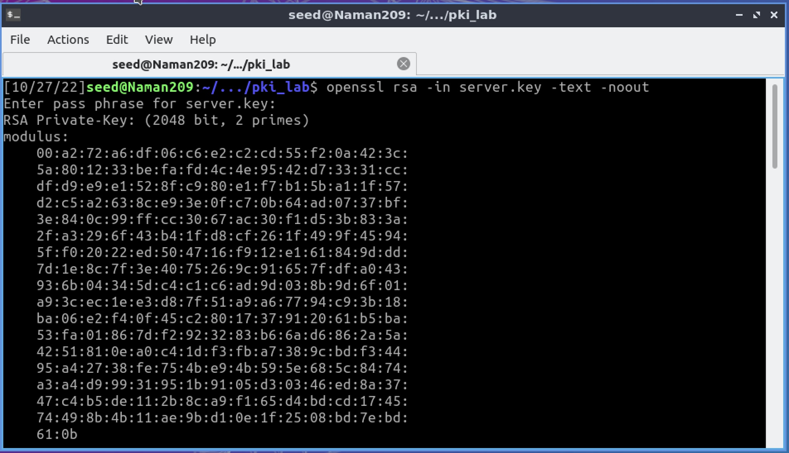

### Task 3:Generating a Certificate for your server

```bash
openssl ca -config openssl.cnf
-policy policy_anything -md sha256 -days 3650
-in server.csr -out server.crt
-batch -cert ca.crt
-keyfile ca.key

```
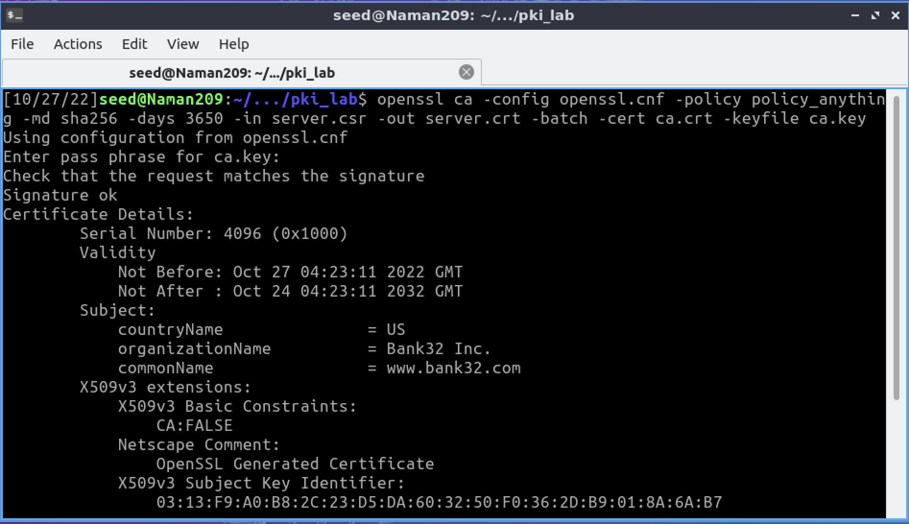


```bash
openssl x509 -in server.crt -text -noout
```
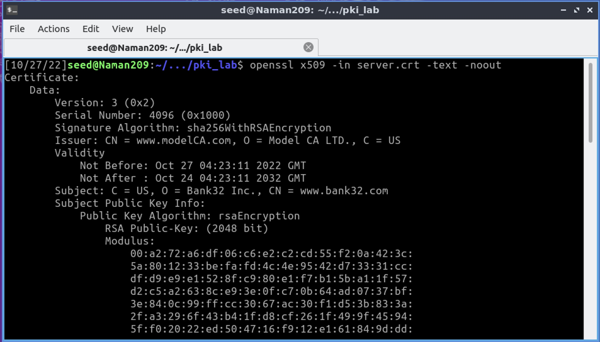


### Task 4:Deploying Certificate in an Apache-Based HTTPS Website


```bash
dock ps
docksh <id of container>
```
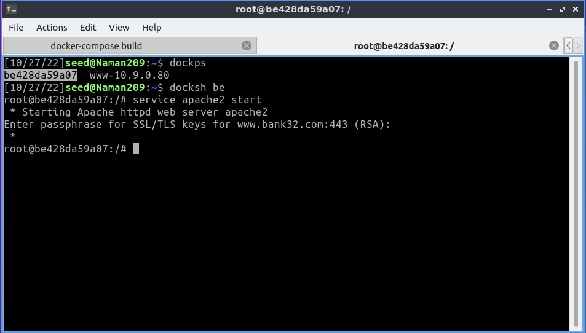


#### Open `bank32.com`

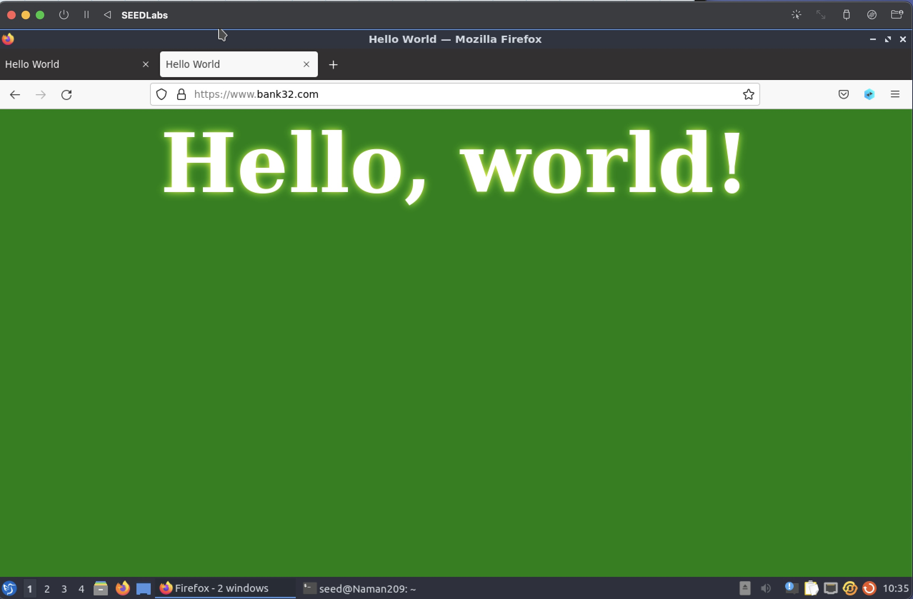

Security:

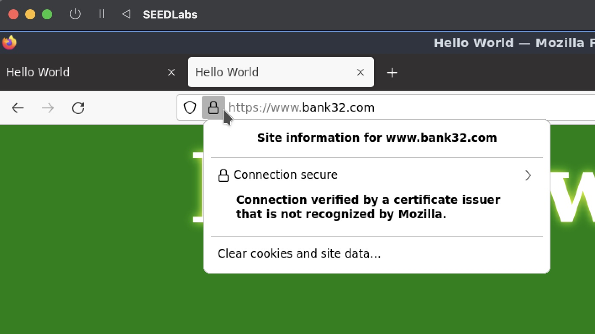

#### Open `10.9.0.80`

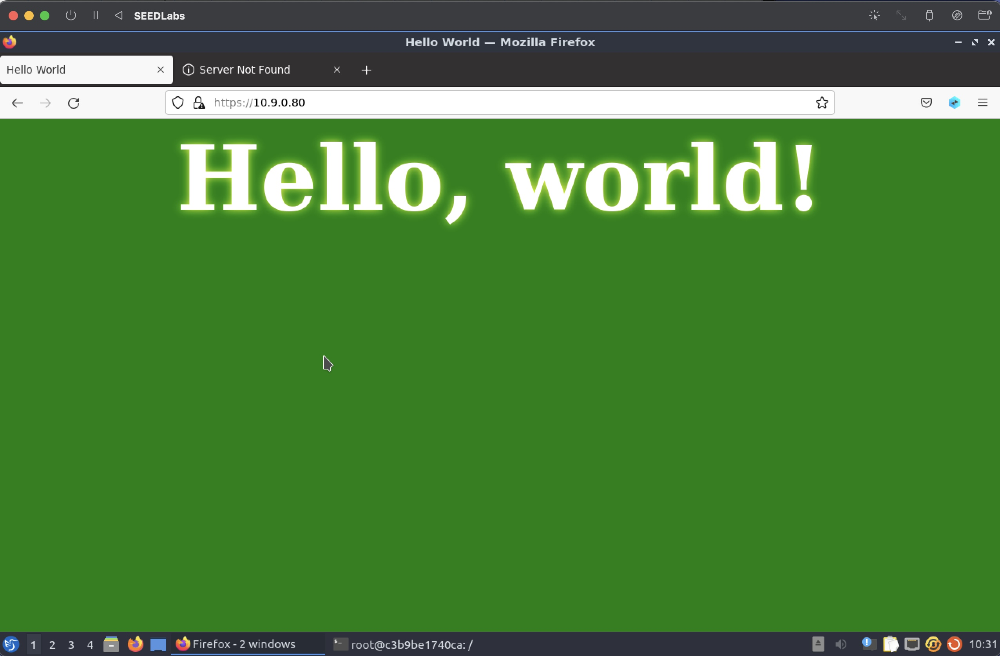


**Observation:** We are taken to the same website after entering the ip address of the website directly

### Task 5:Launching a Man-In-The-Middle Attack

#### Open `example.com`

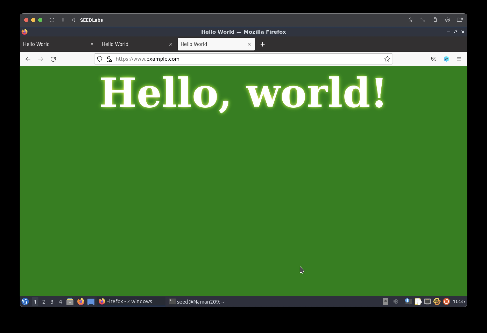

**Observation:** Now, in spite of example.com being a valid domain of a different website, we are still taken to our malicious website with the ip `10.9.0.80` , this shows that the attack was successful.