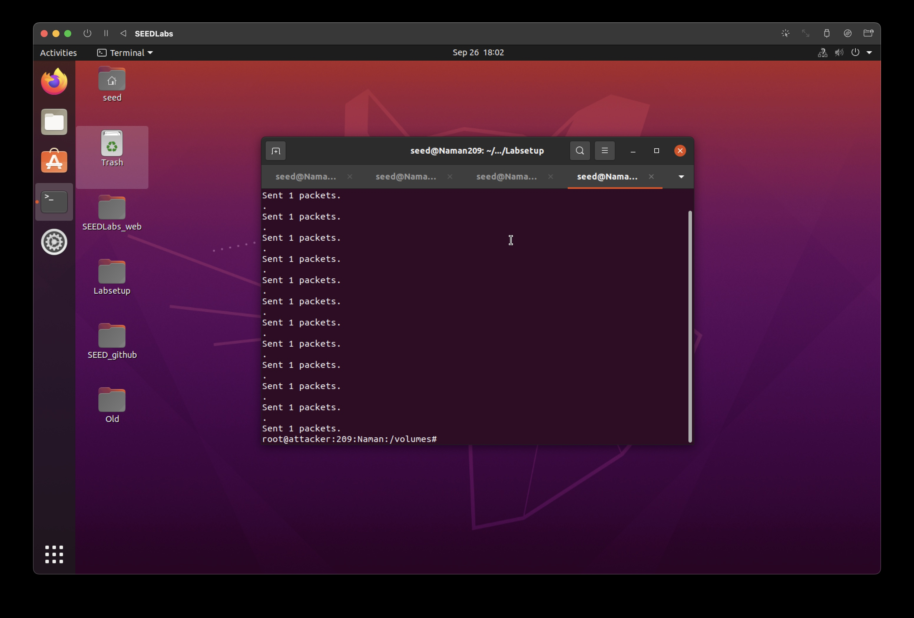
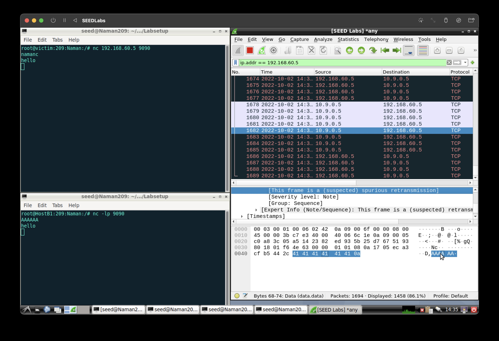

# Computer Network Security

<table style="width:100%">
  <tr>
    <th align="left">Name</th>
    <td>Naman Choudhary</td>
  </tr>
  <tr>
    <th align="left">SRN</th>
    <td>PES2UG20CS209</td>
  </tr>
  <tr>
    <th align="left">Section</th>
    <td>D</td>
  </tr>
</table>

# ICMP Attack

## Task 1: Launching ICMP Redirect Attack
**Command:** 

ip route

**Command:** 

sysctl net.ipv4.conf.all.accept_redirects=1

**Screenshot:**

### Task 1A
**Command:** 

ping 192.168.60.6

**Screenshot:**

**Command:** 

python3 task1A.py

**Screenshot:**

**Command:** 

ip route show cache

mtr -n 192.168.60.5

**Screenshot:**

#### Question 1
#####  Can you use ICMP redirect attacks to redirect to a remote machine? Namely, the IP address assigned to icmp.gw is a computer not on the local LAN.
##### -> No, we cannot use the ICMP redirect attacks to redirect to a remote machine as our packet will be routed to a different network by the gateway router
**Command:** 

ping 192.168.60.5

**Screenshot:**

**Command:** 

python3 task1B.py

**Screenshot:**

**Command:** 

ip route show cache

mtr -n 192.168.60.5

**Screenshot:**

#### Question 2
##### Can you use ICMP redirect attacks to redirect to a non-existing machine on the same network?
##### -> Yes, we can use the ICMP redirect attack to redirect to a non-existing machine on the same network 
**Command:** 

ping 192.168.60.5

**Screenshot:**

**Command:** 

python3 task1C.py

**Screenshot:**

**Command:** 

ip route show cache

mtr -n 192.168.60.5

**Screenshot:**

#### Question 3
##### If you look at the docker-compose.yml file, you will find the following entries for the malicious router container. What are the purposes of these entries?
##### -> The purpose of the entries is to enable redirection of the data packets to carry out the attack
**Command:** 

ping 192.168.60.5

**Screenshot:**

**Command:** 

python3 task1A.py

**Screenshot:**

**Command:** 

ip route show cache

mtr -n 192.168.60.5

**Screenshot:**

## Task 2: Launching the MITM Attack
### Task 2A: Netcat Connection

**Command:** 

nc -lp 9090

nc 192.168.60.5 9090

**Screenshot:**

### Task 2B: To launch the MITM Attack

**Command:** 

python3 mitm.py

**Screenshot:**

**Wireshark**
**Screenshot:**

#### Question 4
##### In your MITM program, you only need to capture the traffic in one direction. Please indicate which direction, and explain why.
##### -> In the MITM program, the capturing should be from the victim to the malicious router as the packet that is sent from host B1 has to be spoofed and send , which leaves the victim unaware of such a spoofing

#### Question 5
##### In the MITM program, when you capture the nc traffic from A (10.9.0.5), you can use A’s IP address or MAC address in the filter. One of the choices is not good and is going to create issues, even though both choices may work. Please try both, and use your experiment results to show which choice is the correct one, and please explain your conclusion.
##### -> Using ether as the filter is a bad choice, as, when using MAC address, the router forwards the packet to the next router without it involving the malicious router in any of the steps

##### f='tcp and src host 10.9.0.5'

**Command:** 

python3 mitm.py

**Screenshot:**

**Wireshark**
**Screenshot:**

##### f='tcp and ether host 02:42:0a:09:00:05'

**Command:** 

python3 mitm.py

**Screenshot:**

**Wireshark**
**Screenshot:**

