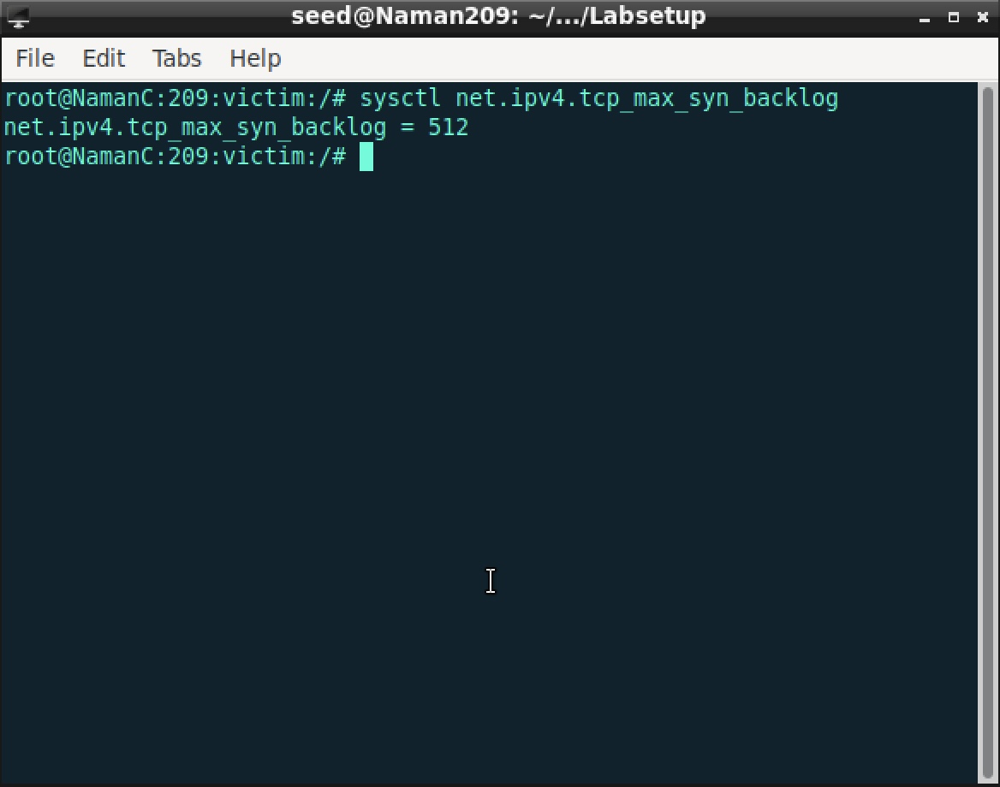

# Computer Network Security

<table style="width:100%">
  <tr>
    <th align="left">Name</th>
    <td>Naman Choudhary</td>
  </tr>
  <tr>
    <th align="left">SRN</th>
    <td>PES2UG20CS209</td>
  </tr>
  <tr>
    <th align="left">Section</th>
    <td>D</td>
  </tr>
</table>

## Lab 4 - TCP Attack Lab

### Task 1: SYN Flooding Attack

**Command:** sysctl net.ipv4.tcp_max_syn_backlog

**Screenshots:**


**Command:** 

sysctl net.ipv4.tcp_syncookies=0

netstat -tna

**Screenshots:**


### Task 1.1: Launching the Attack Using Python


**Command:** python3 synflood.py

**Screenshots:**


**Command:** telnet 10.9.0.5

**Screenshots:**

Faliure


Success


### Task 1.2: Launching the Attack Using C


**Command:** 
 gcc -o synflood synflood.c
 
synflood 10.9.0.5 23

**Screenshots:**


### Task 1.3: Enable the SYN Cookie Countermeasure


**Command:** 
sysctl -w net.ipv4.tcp_syncookies=1

python3 synflood.py

**Screenshots:**


**Command:** 
sysctl -w net.ipv4.tcp_syncookies=1

synflood 10.9.0.5 23

**Screenshots:**


### Task 2: TCP RST Attacks on Telnet Connections

**Command:** 
telnet 10.9.0.5

**Wireshark Screenshots:**


**Command:** 
python3 reset.py

**Screenshots:**


**Wireshark Screenshots**


reset flag sent


Observation: The connection between host and victim is broken

#### Launching the attack automatically
**Wireshark Screenshots:**


**Command:** 
python3 reset_auto.py

**Screenshots:**


**Wireshark Screenshots:**

Observation: A spam of reset flags is being sent to break the connection between host and victim

### Task 3: TCP Session Hijacking
**Command:**
On User 1 (remotely logged onto the Victim) $ cat > secret
(enter your desired text)

**Screenshots:**


**Command:** 
telnet 10.9.0.5

**Wireshark Screenshots:**


**Command:** 
 nc -l 9090 & python3 hijack.py

**Screenshots:**

Observation: The secret stored in `secret` file has been revealed

```
Oh no, you have found the secret
```

**Wireshark Screenshots:**


### Task 4:Creating Reverse Shell using TCP Session Hijacking

**Command:**
telnet 10.9.0.5

nc -l 9090 & python3 reverse.py

**Screenshots:**


**Wireshark Screenshots:**


Attack successful