# Computer Network Security

<table style="width:100%">
  <tr>
    <th align="left">Name</th>
    <td>Naman Choudhary</td>
  </tr>
  <tr>
    <th align="left">SRN</th>
    <td>PES2UG20CS209</td>
  </tr>
  <tr>
    <th align="left">Section</th>
    <td>D</td>
  </tr>
</table>

## Remote DNS Attack Lab

### Task 0:

```
dig ns.attacker32.com
```
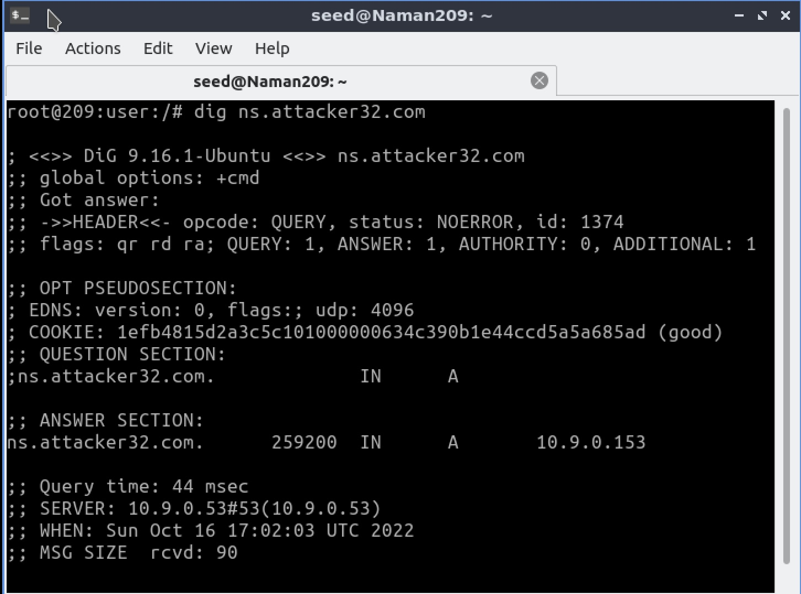


```
dig www.example.com
dig @ns.attacker32.com www.example.com
```
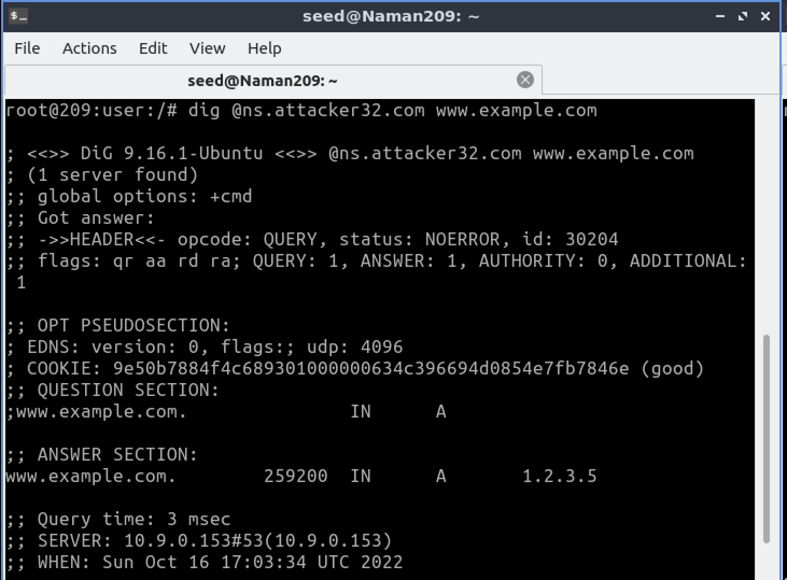

### Task 1: Construct DNS request

```
python3 generate_dns_query.py
```

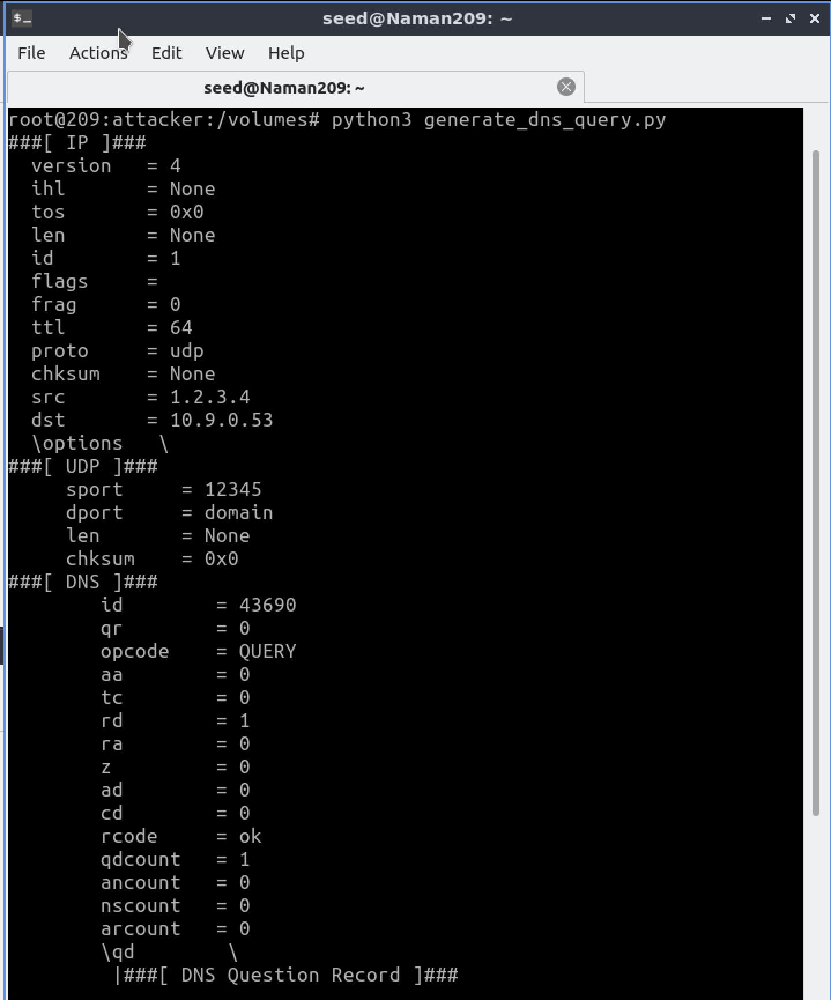


### Task 2: Spoof DNS Replies

```
dig NS example.com
dig +short a [example.com name server’s name]
```

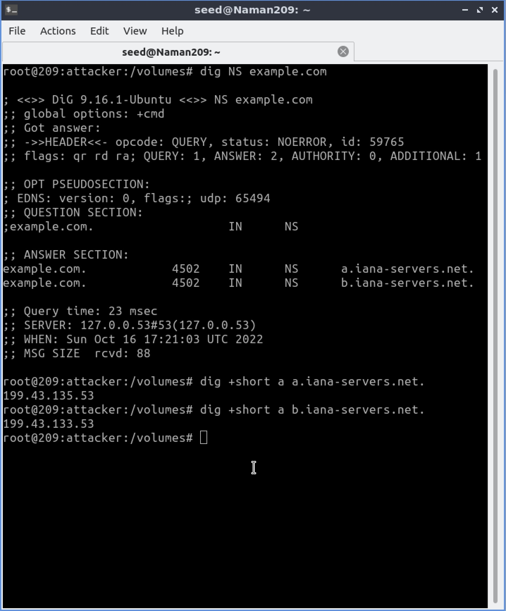

```
python3 generate_dns_reply.py
```

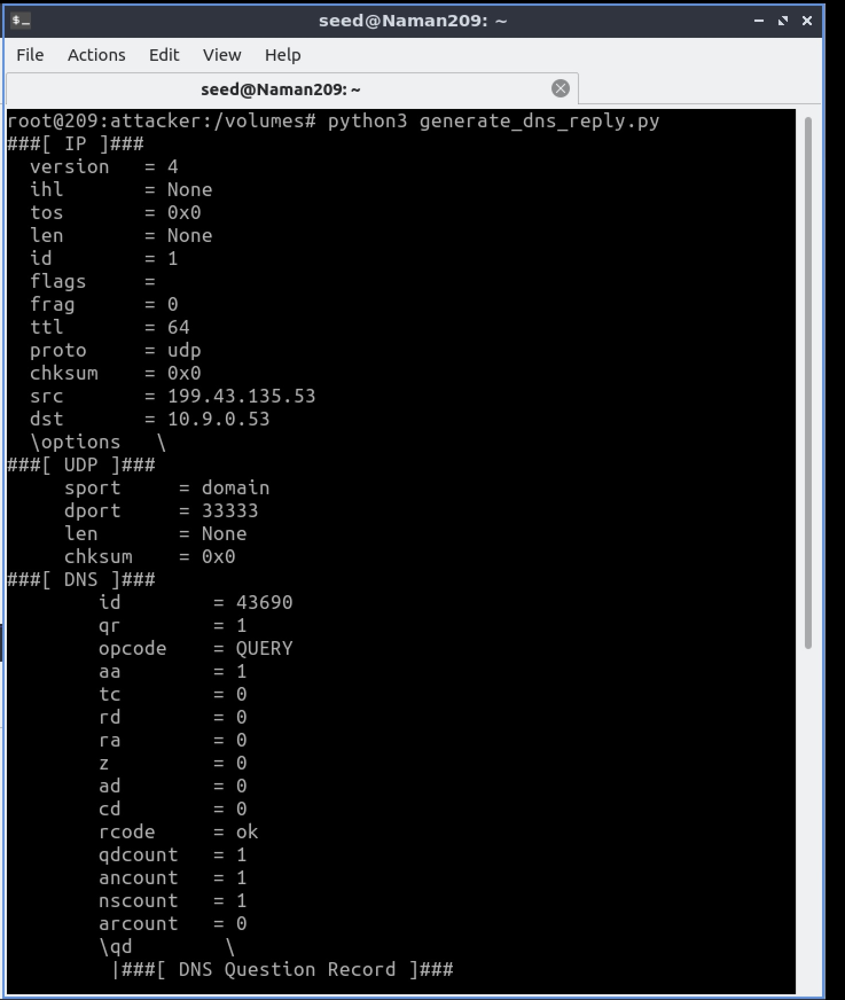

Wireshark:
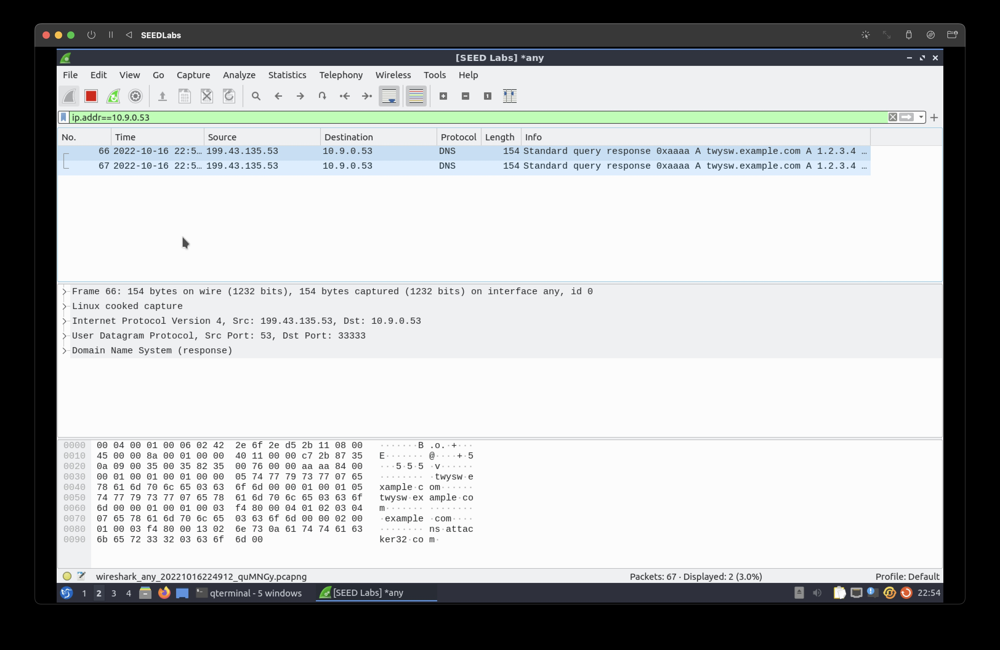

Observation: Spoofed DNS packets observed

### Task 3: Launch the Kaminsky Attack

```
gcc -o kaminsky attack.c
./kaminsky
```

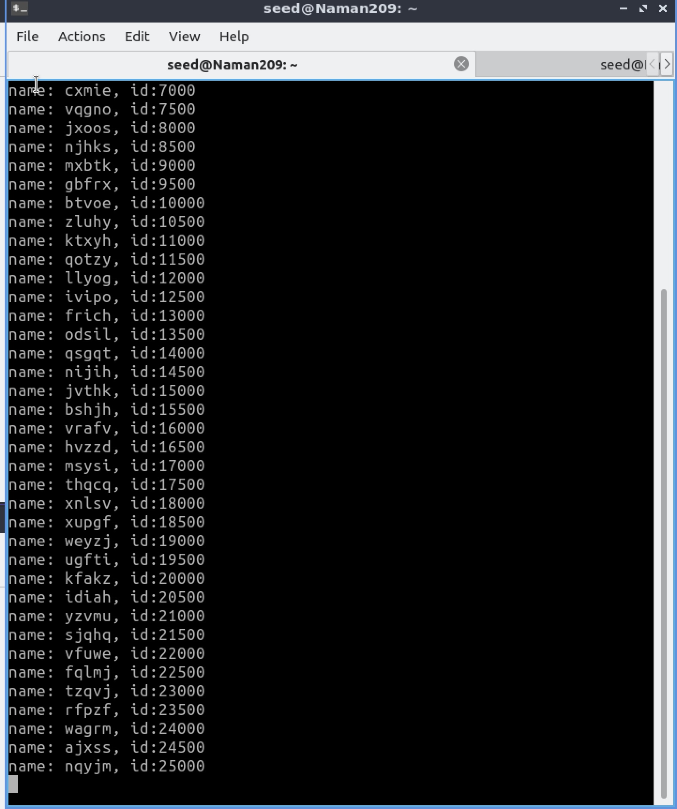

```
rndc dumpdb -cache && grep attacker /var/cache/bind/dump.db
```

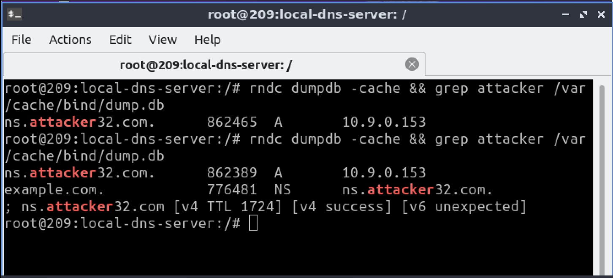

Observation: Spoofed nameserver appears in the dump

### Task 4: Result Verification 

```
dig www.example.com
```
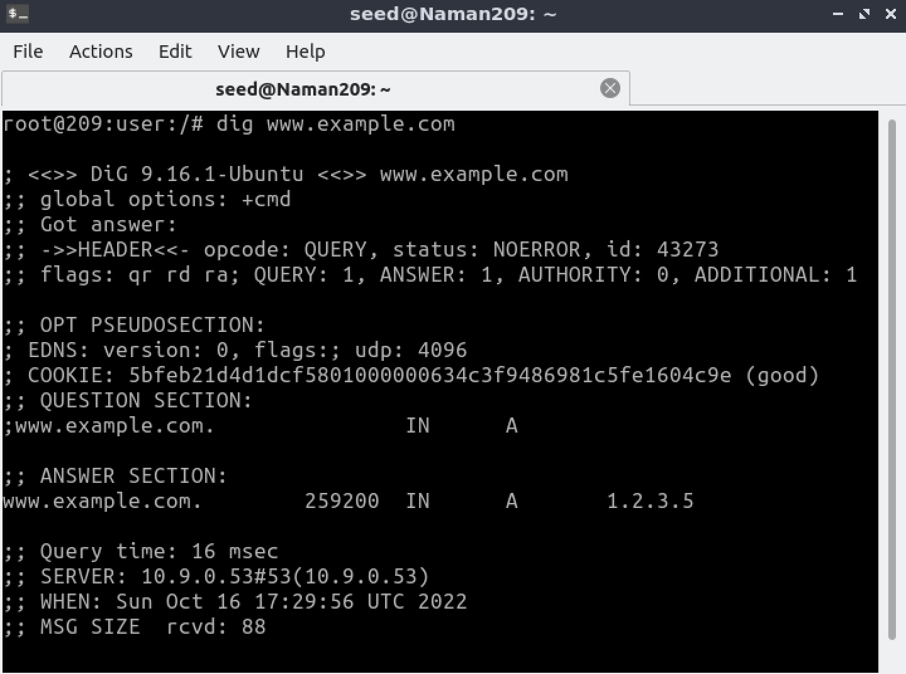


```
dig @ns.attacker32.com www.example.com
```


Wireshark:

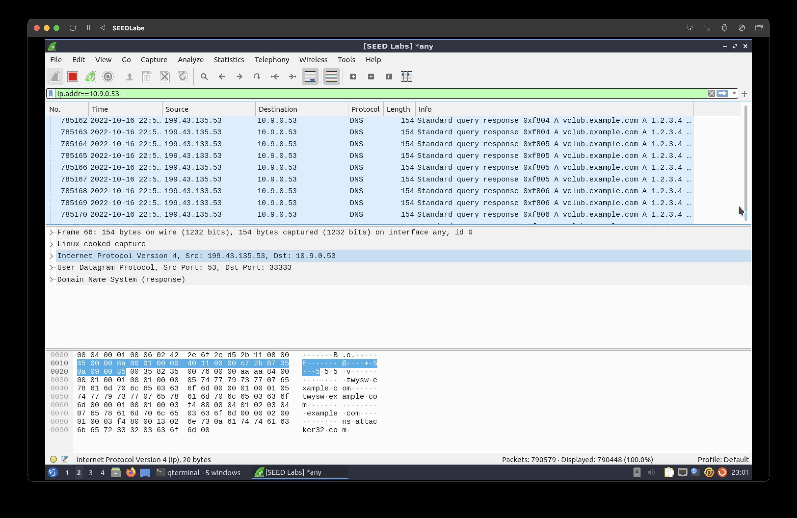
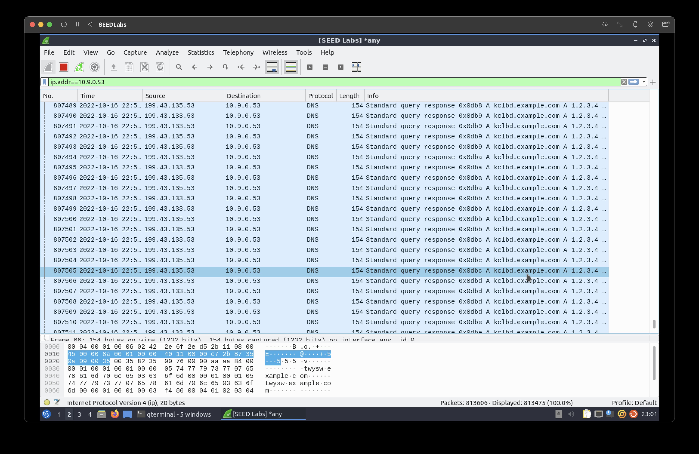

Observation: The attack was successful because we ran the Kaminsky attack, where the NameServer is spoofed from an external DNS source