# Computer Network Security

<table style="width:100%">
  <tr>
    <th align="left">Name</th>
    <td>Naman Choudhary</td>
  </tr>
  <tr>
    <th align="left">SRN</th>
    <td>PES2UG20CS209</td>
  </tr>
  <tr>
    <th align="left">Section</th>
    <td>D</td>
  </tr>
</table>

## Firewall Exploration Lab

### Task 0: Get Familiar with the Lab Setup

In router:

```bash
iptables -A FORWARD -i eth1 -d 13.107.42.0/24 -j DROP
 iptables -A FORWARD -i eth1 -d 13.33.33.59/24 -j DROP

```

Note `13.249.221.0/24` changed to `13.33.33.59/24` for relevant `miniclip.com` ip

In B/B1/B2:

```bash
ping www.linkedin.com
ping www.miniclip.com
```

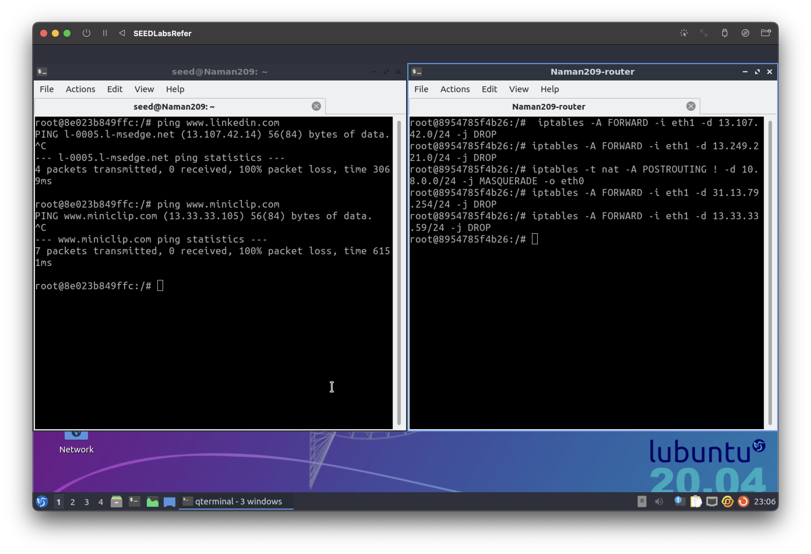


### Task 1: Static Port Forwarding

In Container A:

```bash
ssh -L 0.0.0.0:8000:192.168.20.99:23 root@192.168.20.99
```

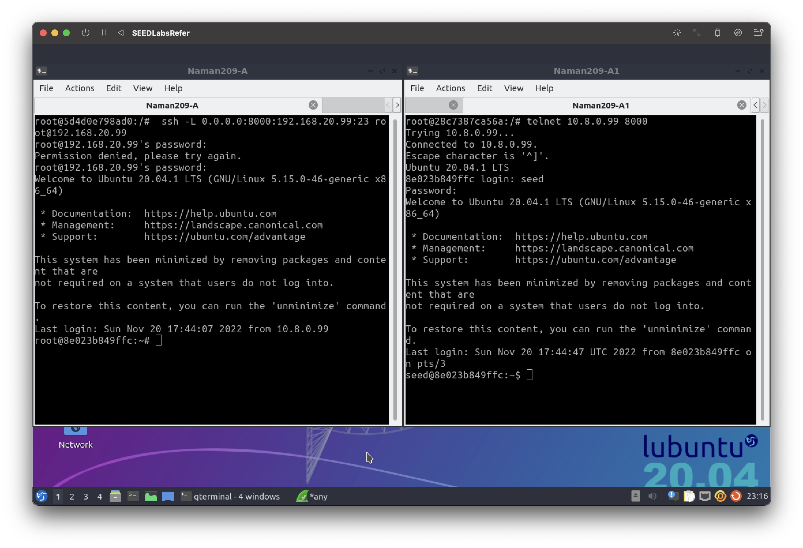

In Container A1 and A2:

```bash
telnet 10.8.0.99 8000
```

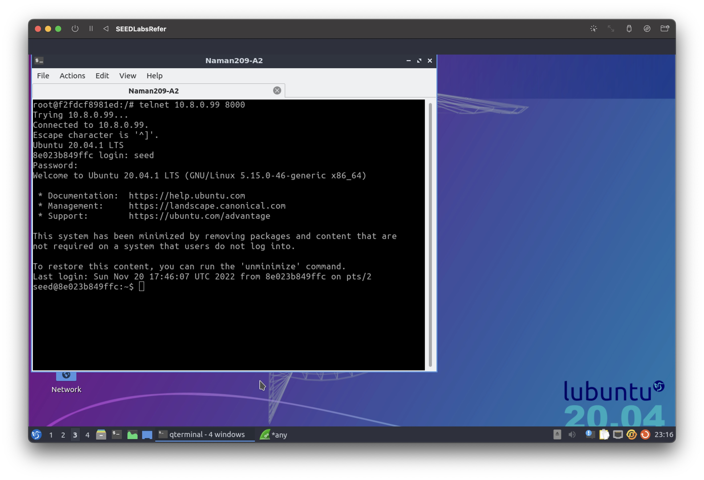


### Task 2: Dynamic Port Forwarding

### Task 2.1: Setting Up Dynamic Port Forwarding

In B:

```bash
 ssh -4 -D 0.0.0.0:8000 root@10.8.0.99 -f -N
 curl -x socks5h://0.0.0.0:8000 http://www.example.com

```

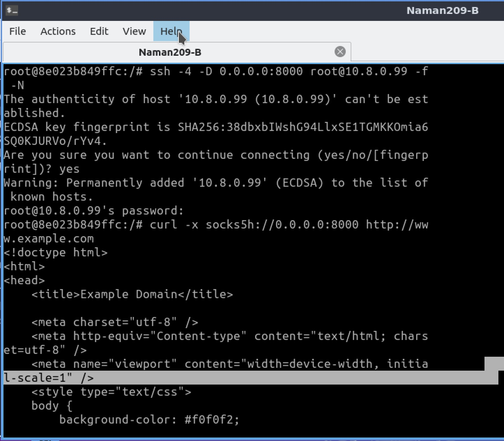

In B1 and B2:

```bash
curl -x socks5h://192.168.20.99:8000 http://www.example.com
```

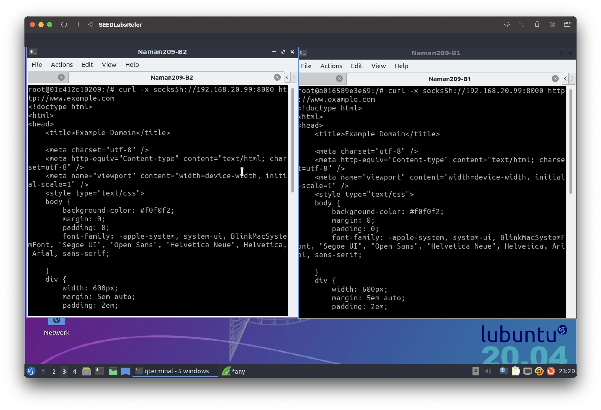


### Task 2.2: Testing the Tunnel Using Browser

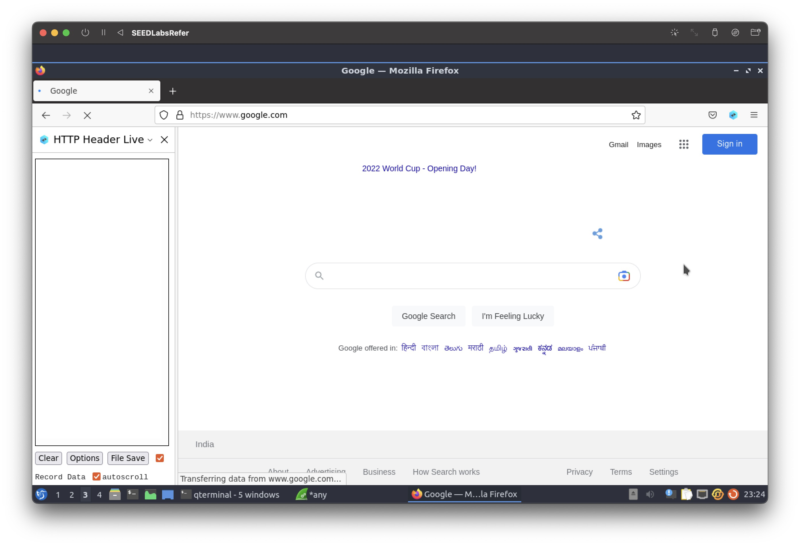
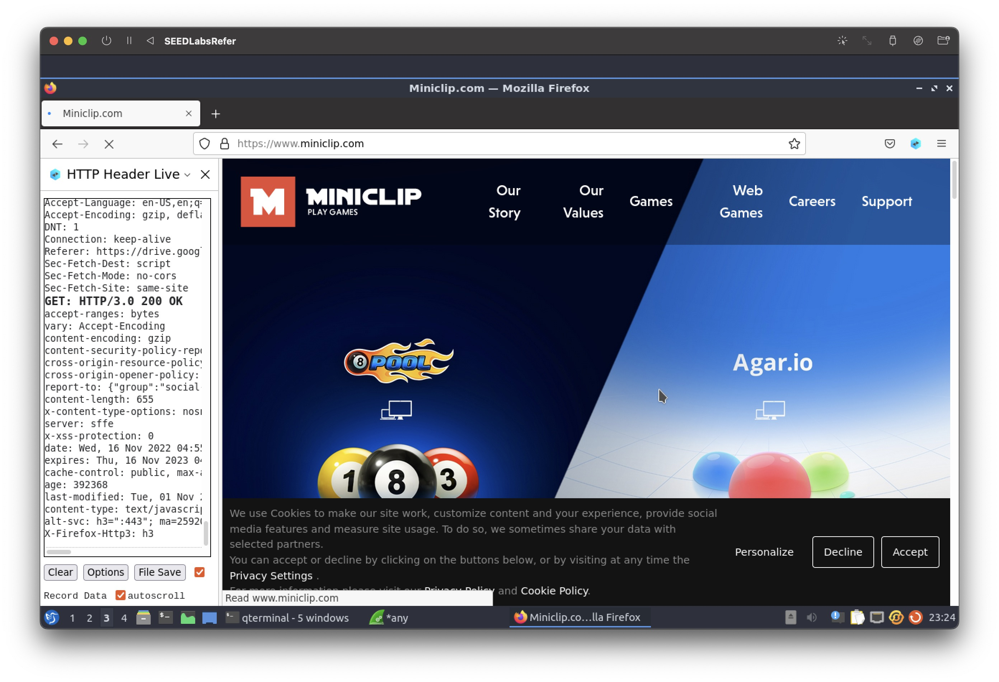


```bash
 ps -eaf | grep "ssh"
```
 
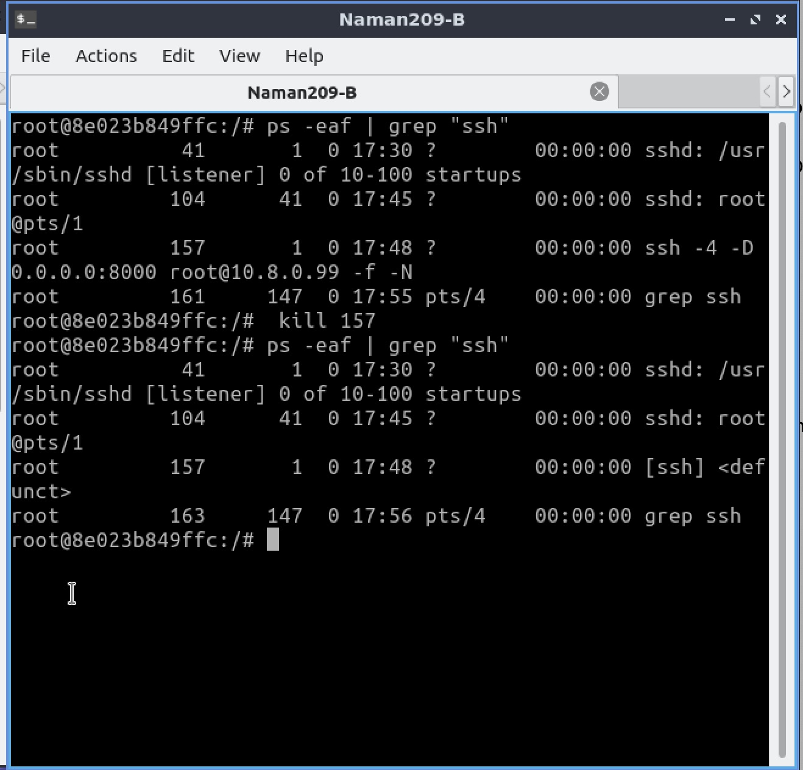

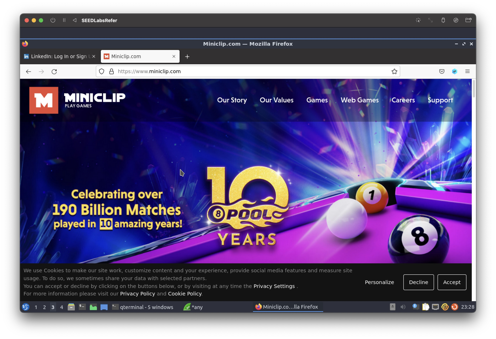


**Observation**: Inspite of firewall being active, we were successful in accessing the website due to evasion

### Task 2.3: Writing a SOCKS Client Using Python

In B:

```bash
ssh -4 -D 0.0.0.0:8000 root@10.8.0.99 -f -N
python3 B-Socks-Client.py
```

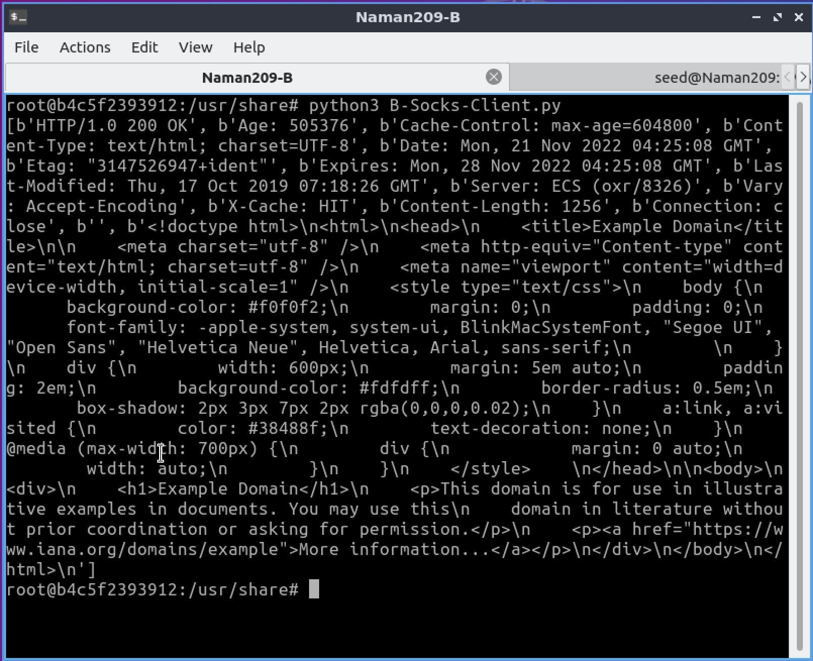

In B1 and B2:

```bash
python3 B1-B2-Socks-Client.py
ps -eaf | grep "ssh"
kill 
```

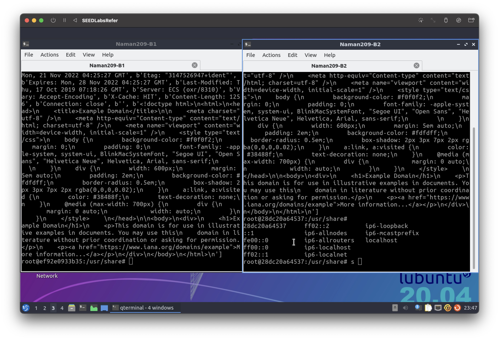


### Task 3: Comparing SOCKS5 Proxy and VPN


**Question:** Both SOCKS5 proxy (dynamic port forwarding) and VPN are commonly used in creating tunnels to bypass firewalls, as well as to protect communications. Many VPN service providers provide both types of services. Sometimes, when a VPN service provider tells you that it provides the VPN service, but in reality, it is just a SOCKS5 proxy. Although both technologies can be used to solve the same
problem, they do have significant differences. Please compare these two technologies, describing their differences, pros and cons.


**Answer:** 


<style type="text/css">
.tg  {border-collapse:collapse;border-spacing:0;}
.tg td{border-color:black;border-style:solid;border-width:1px;font-family:Arial, sans-serif;font-size:14px;
  overflow:hidden;padding:10px 5px;word-break:normal;}
.tg th{border-color:black;border-style:solid;border-width:1px;font-family:Arial, sans-serif;font-size:14px;
  font-weight:normal;overflow:hidden;padding:10px 5px;word-break:normal;}
.tg .tg-0pky{border-color:inherit;text-align:left;vertical-align:top}
.tg .tg-0lax{text-align:left;vertical-align:top}
</style>
<table class="tg">
<thead>
  <tr>
    <th class="tg-0pky"><span style="font-weight:bold">SOCKS5</span></th>
    <th class="tg-0pky"><span style="font-weight:bold">VPN</span></th>
  </tr>
</thead>
<tbody>
  <tr>
    <td class="tg-0pky" colspan="2"><span style="font-weight:bold">PROS</span></td>
  </tr>
  <tr>
    <td class="tg-0pky" colspan="2">Masks User IP address</td>
  </tr>
  <tr>
    <td class="tg-0pky">Hides user identity for torrent clients</td>
    <td class="tg-0pky">Provides data encryption</td>
  </tr>
  <tr>
    <td class="tg-0lax">Faster than VPN</td>
    <td class="tg-0lax"></td>
  </tr>
  <tr>
    <td class="tg-0lax" colspan="2"><span style="font-weight:bold">Cons</span></td>
  </tr>
  <tr>
    <td class="tg-0lax">Third parties can still monitor download activity</td>
    <td class="tg-0lax"></td>
  </tr>
  <tr>
    <td class="tg-0lax" colspan="2"><span style="font-weight:bold">Differences</span></td>
  </tr>
  <tr>
    <td class="tg-0lax">Does not have its own software</td>
    <td class="tg-0lax"><span style="font-weight:400;font-style:normal">Has its own software</span></td>
  </tr>
  <tr>
    <td class="tg-0lax">Less costly</td>
    <td class="tg-0lax">More costly</td>
  </tr>
  <tr>
    <td class="tg-0lax">Works at app level</td>
    <td class="tg-0lax">Works at system level</td>
  </tr>
  <tr>
    <td class="tg-0lax">Used for web traffic (HTTP)</td>
    <td class="tg-0lax">Used for all kinds of traffic</td>
  </tr>
</tbody>
</table>
