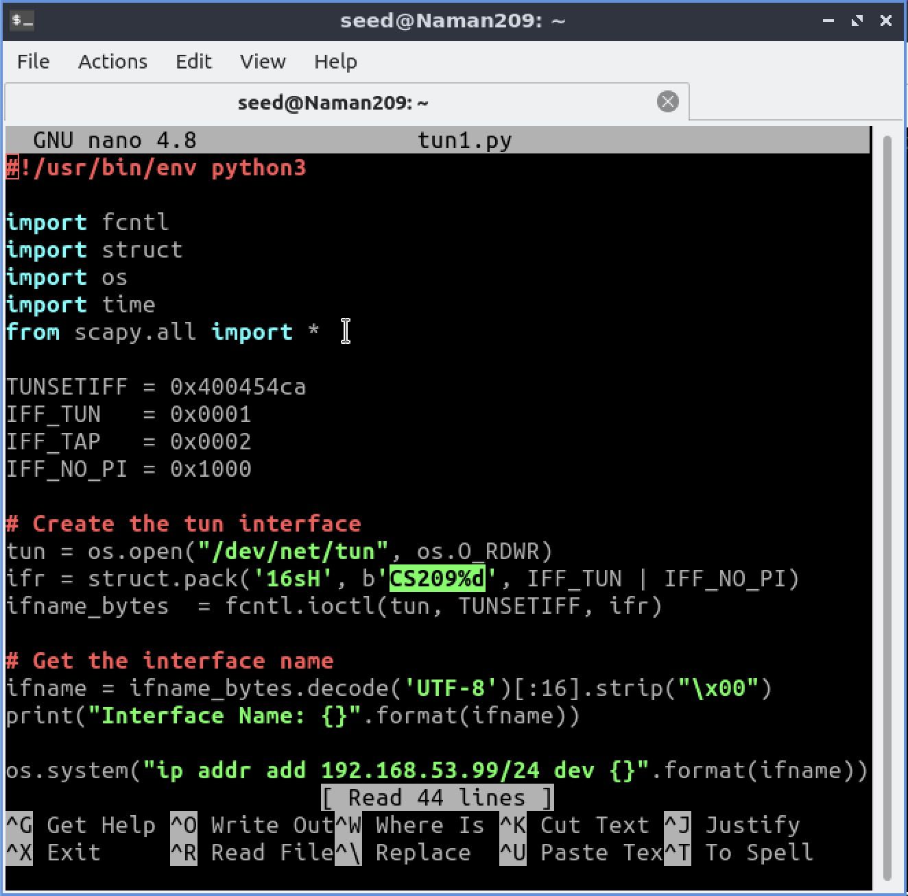

# Computer Network Security

<table style="width:100%">
  <tr>
    <th align="left">Name</th>
    <td>Naman Choudhary</td>
  </tr>
  <tr>
    <th align="left">SRN</th>
    <td>PES2UG20CS209</td>
  </tr>
  <tr>
    <th align="left">Section</th>
    <td>D</td>
  </tr>
</table>

## VPN Tunneling Lab

### Task 1: Network Setup


On Client-10.9.0.5

```bash
ping server-router
```


In router

```bash
ping 192.168.60.5
```


On Client-10.9.0.5

```bash
ping 192.168.60.5
```


```bash
tcpdump -i eth0 -n
```


```bash
ping server-router
```


### Task 2: Create and Configure TUN Interface

### Task 2.a: Name of the Interface

```bash
chmod a+x tun.py
./tun.py &
ip addr
```


Change tun to SRN


```bash
chmod a+x tun.py
./tun.py &
ip addr
```


### Task 2.b: Set up the TUN Interface

```bash
ip addr add 192.168.53.99/24 dev <SRN>0
ip link set dev <SRN>0 up
```


### Task 2.c: Read from the TUN Interface

Replace code :

```py
while True:
# Get a packet from the tun interface
	packet = os.read(tun, 2048)
	if packet:
		ip = IP(packet)
		print(ip.summary())

```


```bash
ip addr add 192.168.53.99/24 dev <SRN>0
ip link set dev <SRN>0 up
```


**Observation:** Yes, `ping 192.168.53.5` prints out `IP / ICMP 192.168.53.99 > 192.168.53.5 echo-request 0 / Raw`

No, `ping 192.168.60.5` loses all packets

### Task 2.d: Write to the TUN Interface

Change tun to SRN



```bash
chmod a+x tun.py
./tun1.py &
ip addr
```


```bash
ping 192.168.53.5
```


### Task 3: Send the IP Packet to VPN Server Through a Tunnel


Change tun to SRN


```bash
chmod a+x tun_server.py
./tun_server.py
```

```bash
chmod a+x tun_client.py
./tun_client.py &
ip addr
```


```bash
ping 192.168.53.5
ping 192.168.60.5
```


```bash
 ip route
```


### Task 4: Set Up the VPN Server

```bash
chmod a+x tun_server1.py
./tun_server1.py
```

```bash
ping 192.168.60.5
```


```bash
tcpdump -i eth0 -n
```


### Task 5: Handling Traffic in Both Directions

Change tun to SRN


```bash
 chmod a+x tun_client_select.py
 ./tun_client_select.py
```

```bash
ping 192.168.60.5
```


```bash
chmod a+x tun_server_select.py
./tun_server_select.py
```


Wireshark:


```bash
telnet 192.168.60.5
```


Wireshark:


### Task 6: Tunnel-Breaking Experiment

```bash
telnet 192.168.60.5
```

and then breaking the connection off [last 7 lines]


Bringing connection back

```bash
./tun_server_select.py
```


