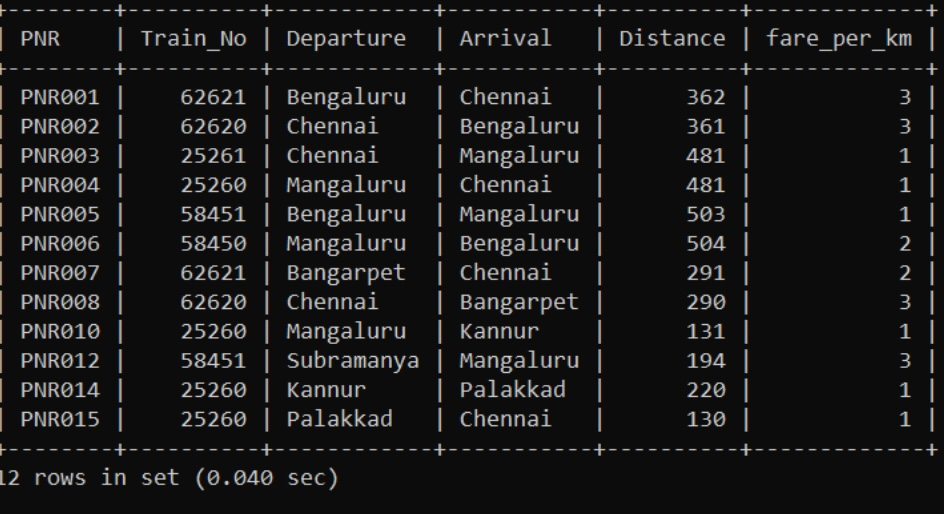
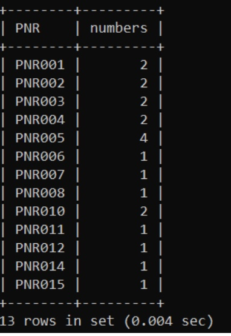
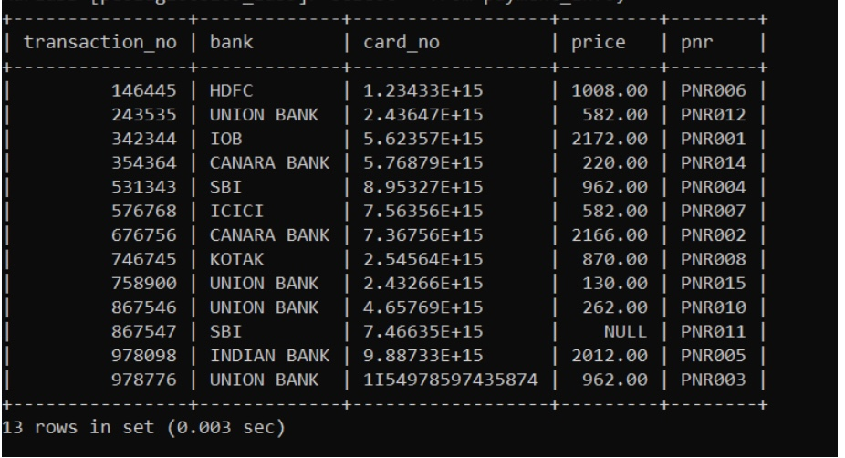
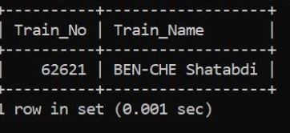
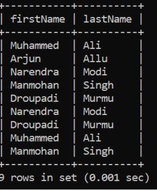
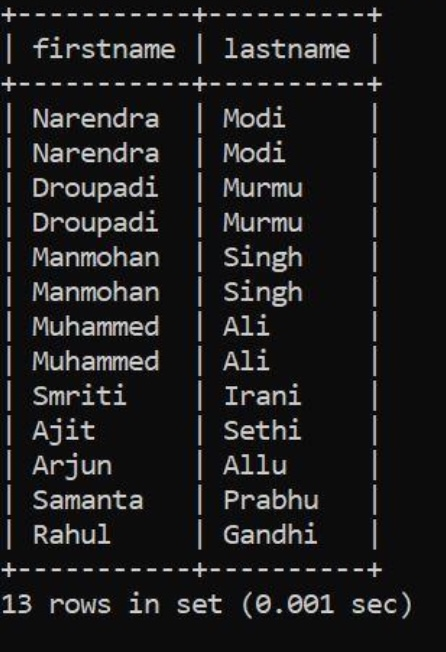
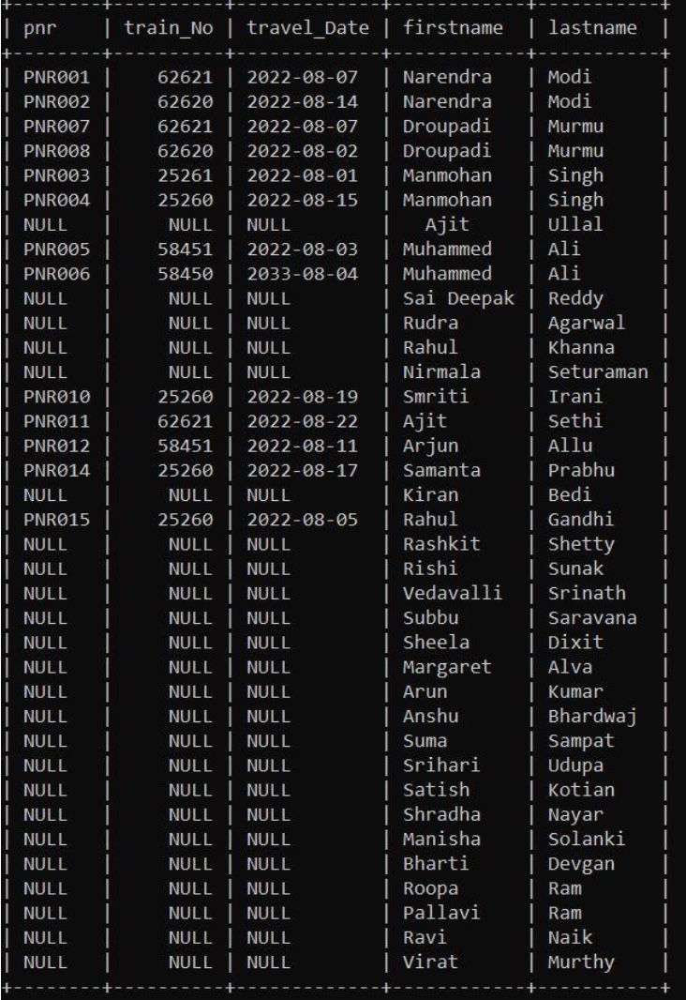
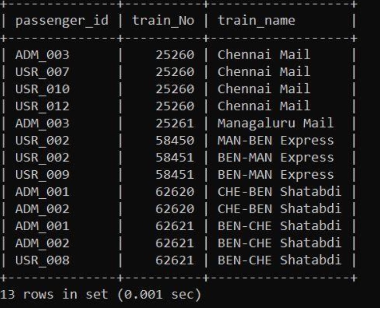
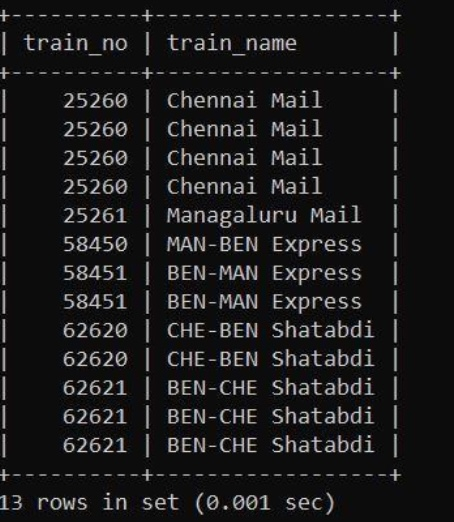
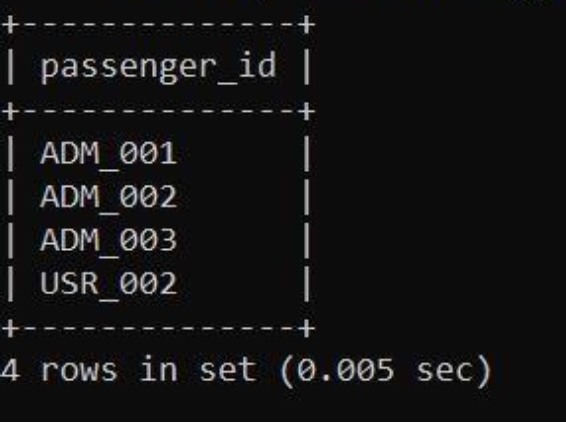

# Database Management System

<table style="width:100%">
  <tr>
    <th align="left">Name</th>
    <td>Naman Choudhary</td>
  </tr>
  <tr>
    <th align="left">SRN</th>
    <td>PES2UG20CS209</td>
  </tr>
  <tr>
    <th align="left">Section</th>
    <td>D</td>
  </tr>
</table>

## Lab 5
### SQL – Joins: Inner, Outer; Sub queries: Correlated and Uncorrelated

##Task 1 a:

##Task 1 b:

##Task 1 c:

##Task 2:

##Task 3:

##Task 4:

##Task 5:

##Task 6:

##Task 7:

##Task 8:

##Task 9:

##Task 10:

